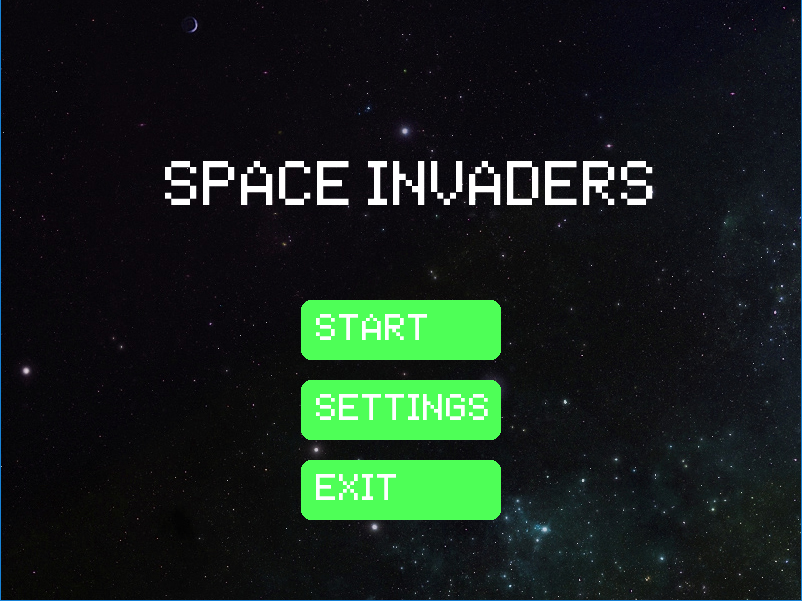
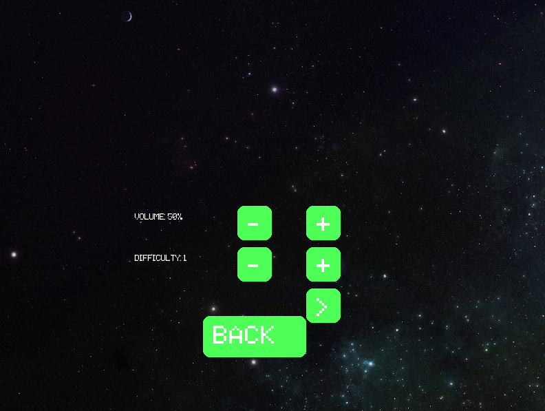
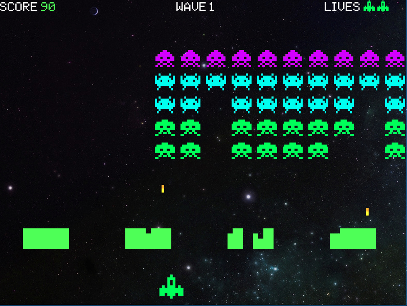

## Управление
- **Стрелки влево/вправо** — движение корабля
- **Пробел** — стрельба
- **P** — пауза
- **Esc** — выход

## Автор
- chibabahcha

## Особенности
- Несколько уровней сложности(Сломан/Недоделан)
- Настраиваемый уровень громкости
- Выбор фона игры в настройках
- Сохранение лучших результатов
- Пауза во время игры (клавиша P)

## Установка
1. Убедись, что у тебя установлен Python 3.x.
2. Установи библиотеку Pygame:

## Скриншоты

